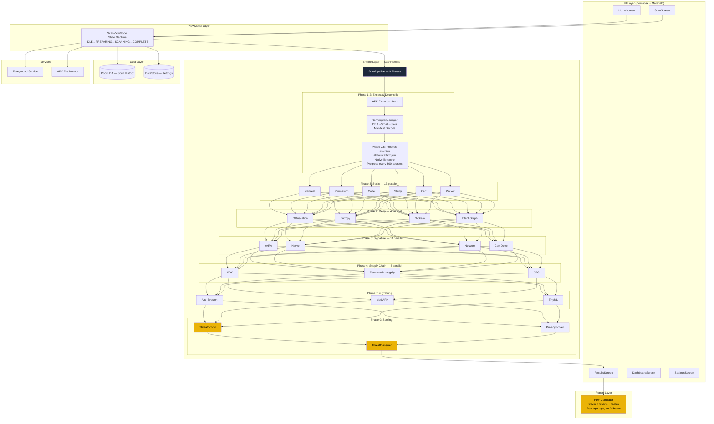
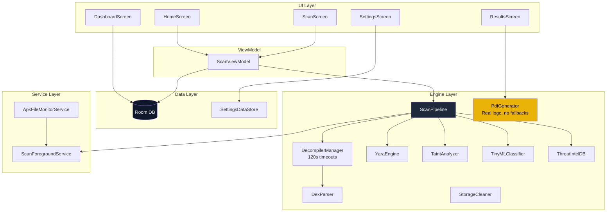

# APK Viper Architecture

## Overview

APK Viper is an **on-device Android APK security analyzer** — 13K+ lines of Kotlin across 80+ source files, 38+ detection engines, 9-phase scan pipeline. All analysis runs locally with zero network calls. **1133+ unit tests, 0 failures, 100% pass.**

```
┌──────────────────────────────────────────────────────────────────┐
│                     APK VIPER ARCHITECTURE                        │
├──────────────────────────────────────────────────────────────────┤
│                                                                   │
│  ┌──────────┐    ┌───────────┐    ┌──────────────────────────┐   │
│  │   UI     │◄──►│ ViewModel │◄──►│     ScanPipeline          │   │
│  │  Compose │    │  (State   │    │  (9 Phases, supervisorScope)│   │
│  │  Screens │    │  Machine) │    │  ┌──────────────────────┐ │   │
│  └──────────┘    └───────────┘    │  │ 38+ Analyzers in     │ │   │
│                                   │  │ async/awaitAll per   │ │   │
│                                   │  │ phase — IO dispatcher│ │   │
│                                   │  └──────────────────────┘ │   │
│                                   └──────────────────────────┘   │
│                                              │                    │
│                                   ┌──────────▼──────────┐        │
│                                   │      Data Layer       │        │
│                                   │  Room DB + DataStore  │        │
│                                   └──────────────────────┘        │
│                                                                   │
└──────────────────────────────────────────────────────────────────┘
```

## Architecture Patterns

| Pattern | Application |
|---------|-------------|
| **Pipeline** | 9 sequential phases, each with parallel analyzer execution |
| **SupervisorScope** | Isolated coroutine per analyzer — one failure never kills the scan |
| **State Machine** | ScanViewModel: IDLE → PREPARING → SCANNING → COMPLETE / ERROR |
| **Repository** | Room DB abstracts scan history, DataStore for preferences |
| **Observer** | StateFlow from ScanPipeline → ViewModel → Compose recomposition |
| **Strategy** | Each analyzer implements a consistent `analyze()` interface |
| **Factory** | DecompilerManager creates DexParser + SmaliDisassembler instances |
| **Callback** | Progress lambda threaded through all 9 phases + Phase 2.5 sub-steps |

## 9-Phase Pipeline — Detail

```
Phase 1 ─── Extract APK → SHA256/MD5 hash → XAPK detection
              │ ApkIntegrityVerifier, HashUtils, XapkExtractor
              │
Phase 2 ─── DEX → Smali → Java decompilation → AXML decode
              │ DexParser, SmaliDisassembler, AxmlDecoder
              │ 120s smali timeout, 120s Java timeout, partial results on timeout
              │ Cancellation: isCancelled lambda → DexParser
              │
Phase 2.5 ─── Process decompiled sources (WITHIN Phase 2 progress bar)
              │ allSourceText join with cancellation check every 100 sources
              │ Native lib cache with parseCancelled guard
              │ Progress update every 500 sources during join
              │
Phase 3 ─── Static Analysis (13 in parallel)
              │ ManifestAnalyzer │ PermissionAnalyzer │ CodeAnalyzer
              │ StringExtractor │ CertificateAnalyzer │ PackerDetector
              │ CryptoMinerDetector │ DexOpcodeAnalyzer │ TaintAnalyzer
              │ BehavioralDetector │ ApiCallGraphAnalyzer │ PermissionRiskMatrix
              │ SecretLeakScanner │ TinyMLClassifier
              │
Phase 4 ─── Deep Analysis (4 in parallel)
              │ ObfuscationDetector │ EntropyAnalyzer
              │ OpcodeNgramAnalyzer │ IntentRelationGraphAnalyzer
              │
Phase 5 ─── Signature & Native Analysis (11 in parallel)
              │ MalwarePatternDetector │ YaraEngine │ CertificateAnalyzer (deep)
              │ NativeAnalyzer (shallow + deep) │ NativeCallGraphCorrelator
              │ NativeBytecodeScanner │ NativeLibraryDiffer
              │ EntropyPackerDetector │ NetworkAnalyzer
              │
Phase 6 ─── Supply Chain & Integrity (3 in parallel)
              │ SDKAnalyzer │ FrameworkIntegrityChecker │ CfgStructuralAnalyzer
              │
Phase 7 ─── Anti-Evasion + Threat Intel (2 in parallel)
              │ AntiEvasionDetector │ ThreatIntelDB
              │
Phase 8 ─── Behavioral Profiling (10 in parallel)
              │ NativeBehaviorAnalyzer │ StringDeobfuscator
              │ PhishingOverlayAnalyzer │ NetworkBehaviorProfiler
              │ BehaviorTimelineAnalyzer │ BackgroundResourceMonitor
              │ ModApkDetector │ ShizukuDetector │ VirtualAppDetector
              │ AccessibilityChainAnalyzer
              │
Phase 9 ─── Scoring (3 sequential)
              │ PrivacyScorer → ThreatScorer → ThreatClassifier
              │ → ClassificationResult → ScanResult
```



## Threading Model

```
┌──────────────────────────────────────────────────────────────────────┐
│                        THREADING MODEL                                │
├──────────────────────────────────────────────────────────────────────┤
│                                                                       │
│  MAIN THREAD (Dispatchers.Main)                                       │
│  ├── Compose recomposition (all screens)                              │
│  ├── User input: clicks, file picker, navigation                      │
│  └── StateFlow collection → UI state updates                          │
│                                                                       │
│  VIEWMODEL SCOPE (viewModelScope — Dispatchers.Main)                  │
│  ├── State machine: IDLE→PREPARING→SCANNING→COMPLETE                  │
│  ├── Receives progress via callback from ScanPipeline                  │
│  ├── Maps ScanResult to UI state (findings grouped by severity)        │
│  └── Room DAO inserts (via inherited IO context from ScanPipeline)     │
│                                                                       │
│  IO THREAD (Dispatchers.IO)                                           │
│  ├── ScanPipeline: 9 phases sequential                                 │
│  │   ├── Phase 1: ZipFile extraction, hash computation                 │
│  │   ├── Phase 2: DexParser (custom binary parser)                     │
│  │   ├── Phase 2.5: allSourceText join + native lib cache              │
│  │   ├── Phases 3-8: supervisorScope { async/awaitAll }                │
│  │   │   ├── Each analyzer runs in its own async coroutine             │
│  │   │   ├── tryAnalyze wrapper: 45s timeout per analyzer              │
│  │   │   ├── checkCancelled() guard at start of each analyzer          │
│  │   │   └── Progress callback: phase + message                        │
│  │   └── Phase 9: ThreatScorer → PrivacyScorer → ThreatClassifier      │
│  └── Room DB writes (ScanResult insertion)                             │
│                                                                       │
│  DEFAULT THREAD (Dispatchers.Default)                                  │
│  ├── DecompilerManager: smali + Java generation chunks                 │
│  │   ├── 120s timeout per generation phase                             │
│  │   └── Parallel chunks: totalClasses / (cores * 2)                   │
│  └── Memory-adaptive GC: System.gc() every 200 classes if <15% free    │
│                                                                       │
│  SERVICE THREAD (Foreground Service)                                   │
│  ├── ScanForegroundService: keeps process alive during scan            │
│  ├── ApkFileMonitorService: FileObserver on Downloads/                 │
│  └── 30s heartbeat: re-posts notification to prevent dismissal         │
│                                                                       │
└──────────────────────────────────────────────────────────────────────┘
```

## Data Flow

```mermaid
sequenceDiagram
    participant User
    participant HomeScreen
    participant ScanViewModel
    participant ScanPipeline
    participant Decompiler as DecompilerManager
    participant Analyzers
    participant RoomDB

    User->>HomeScreen: Select APK
    HomeScreen->>ScanViewModel: startScan(uri)
    ScanViewModel->>ScanViewModel: state=PREPARING
    Note over ScanViewModel: WakeLock + ForegroundService

    rect rgb(30, 41, 59)
        Note over ScanPipeline: Phase 1: Extract + Hash
        ScanPipeline-->>ScanViewModel: progress(1/9, "Extracting APK")
    end

    rect rgb(30, 41, 59)
        Note over ScanPipeline: Phase 2: Decompile
        ScanPipeline->>Decompiler: decompile(apkFile, timeout=120-300s)
        Decompiler->>Decompiler: DEX parse → Smali (120s timeout)
        Decompiler->>Decompiler: Java stubs (120s timeout)
        Decompiler-->>ScanPipeline: DecompileResult
        ScanPipeline-->>ScanViewModel: progress(2/9, "11358 classes extracted")

        Note over ScanPipeline: Phase 2.5: Process Sources
        ScanPipeline->>ScanPipeline: allSourceText join<br/>(cancel check every 100 sources<br/>progress every 500 sources)
        ScanPipeline->>ScanPipeline: buildNativeLibCache<br/>(cancel check every 5 libs)
        ScanPipeline-->>ScanViewModel: progress update continuously
    end

    rect rgb(30, 41, 59)
        Note over ScanPipeline: Phase 3-8: Main Scan
        loop Each Phase (3 through 8)
            ScanPipeline->>Analyzers: supervisorScope { async(...) }
            par All Analyzers in Phase
                Analyzers-->>ScanPipeline: List<Finding>
            end
            ScanPipeline-->>ScanViewModel: progress(N/9, message)
            ScanPipeline-->>ScanViewModel: onFinding(severity, title)
        end
    end

    ScanPipeline->>Analyzers: PrivacyScorer + ThreatScorer + ThreatClassifier
    Analyzers-->>ScanPipeline: scores + classification
    ScanPipeline-->>ScanViewModel: ScanResult
    ScanViewModel->>RoomDB: insert result
    ScanViewModel->>ScanViewModel: state=COMPLETE
    ScanViewModel->>ScanViewModel: release WakeLock + stop service
```



## Error Handling Strategy

```
┌─────────────────────────────────────────────────────────────────┐
│                        ERROR HANDLING                            │
├─────────────────────────────────────────────────────────────────┤
│                                                                  │
│  ANALYZER-LEVEL ERROR (non-critical)                             │
│  ┌─────────────────────────────────────────────────────────┐     │
│  │ tryAnalyze { analyzer.analyze() } withTimeout(45s)      │     │
│  │ → Catches Exception (re-throws CancellationException)    │     │
│  │ → Logs warning to terminal output                       │     │
│  │ → Returns emptyList<Finding>()                          │     │
│  │ → Other analyzers in same phase continue unaffected      │     │
│  └─────────────────────────────────────────────────────────┘     │
│                                                                  │
│  DECOMPILATION TIMEOUT (Phase 2)                                 │
│  ┌─────────────────────────────────────────────────────────┐     │
│  │ generateSmali(): withTimeout(120s) — returns partial    │     │
│  │ decompileToJava(): withTimeout(120s) — returns partial   │     │
│  │ Both catch TimeoutCancellationException → log + continue │     │
│  │ Scan proceeds with whatever was decompiled before timeout │    │
│  └─────────────────────────────────────────────────────────┘     │
│                                                                  │
│  SOURCE JOIN (Phase 2.5)                                         │
│  ┌─────────────────────────────────────────────────────────┐     │
│  │ checkCancelled() every 100 sources during join          │     │
│  │ onProgress() every 500 sources to update UI             │     │
│  │ 5000-class / 50MB cap → null allSourceText for giant APKs │   │
│  └─────────────────────────────────────────────────────────┘     │
│                                                                  │
│  NATIVE LIB CACHE (Phase 2.5)                                    │
│  ┌─────────────────────────────────────────────────────────┐     │
│  │ Cancellation checked every 5 libs via parseCancelled    │     │
│  │ 200MB total cap, 50MB per-lib cap                       │     │
│  │ Try/catch around entire ZipFile operation                │     │
│  └─────────────────────────────────────────────────────────┘     │
│                                                                  │
│  CRITICAL PHASE ERROR (Phase 1-2: Extract/Decompile)             │
│  ┌─────────────────────────────────────────────────────────┐     │
│  │ Exception propagates to ViewModel                       │     │
│  │ → User sees error notification in scan overlay          │     │
│  │ → Scan marked as FAILED                                 │     │
│  │ → WakeLock released, service stopped                    │     │
│  └─────────────────────────────────────────────────────────┘     │
│                                                                  │
│  CANCELLATION                                                    │
│  ┌─────────────────────────────────────────────────────────┐     │
│  │ ViewModel polls ScanForegroundService.cancelRequested   │     │
│  │ every 500ms. Sets scanCancelled + pipeline.cancel().     │     │
│  │ parseCancelled checked before: each phase, each async   │     │
│  │ block, every 100 sources during join, every 5 libs in   │     │
│  │ native cache. CancellationException thrown immediately. │     │
│  └─────────────────────────────────────────────────────────┘     │
│                                                                  │
│  RESOURCE LEAK PREVENTION                                        │
│  ┌─────────────────────────────────────────────────────────┐     │
│  │ ZipFile always uses .use {} (auto-closes on exception)   │     │
│  │ DEX parser: 50k fields/50k methods/1k interfaces cap    │     │
│  │ 5000-class / 50MB source join cap prevents OOM          │     │
│  │ StorageCleaner runs for temp file cleanup               │     │
│  │ System.gc() triggered after >3000 classes decompiled     │     │
│  └─────────────────────────────────────────────────────────┘     │
│                                                                  │
└─────────────────────────────────────────────────────────────────┘
```

## Component Breakdown

### 1. UI Layer (`com.apkviper.ui.*`)

| Component | File | Responsibility |
|-----------|------|----------------|
| **HomeScreen** | `ui/home/HomeScreen.kt` | Tab navigation (HOME/HISTORY/SETTINGS), APK file picker, BackHandler |
| **ScanScreen** | `ui/scan/ScanScreen.kt` | Real-time scan progress with terminal log, dynamic ETA, auto-navigate on complete |
| **ResultsScreen** | `ui/results/ResultsScreen.kt` | Categorized findings by severity, expandable cards, PDF export button |
| **DashboardScreen** | `ui/dashboard/DashboardScreen.kt` | Scan history with per-package score trend, delete/clear |
| **SettingsScreen** | `ui/settings/SettingsScreen.kt` | Auto-update interval, APK monitor toggle, signature DB status, data management |
| **ScanViewModel** | `ui/scan/ScanViewModel.kt` | State machine, dynamic weighted ETA tracking actual phase durations |

### 2. Engine Layer (`com.apkviper.engine.*`)

#### ScanPipeline (Orchestrator)

The `ScanPipeline` is the central orchestrator. It runs **9 sequential phases**, each executing analyzers in parallel via `supervisorScope` with `async/awaitAll`.

Key implementation details:
- **Progress callback**: Lambda `(phase, total, message)` threaded through all 9 phases + Phase 2.5
- **Cancellation**: `@Volatile var parseCancelled` checked before each phase, each async block, every 100 sources during join, and every 5 native libs
- **OOM protection**: 5000-class / 50MB dual cap on allSourceText join
- **Per-analyzer timeout**: 45s via `tryAnalyze` wrapper
- **Decompile timeout**: 120s for smali, 120s for Java (returns partial results on timeout)
- **Phase 2.5**: Processes decompiled sources with continuous progress updates to prevent apparent hang

#### Key Analyzer Contract

Each analyzer:
- Takes a `DecompileResult` (or specific subset)
- Returns `List<Finding>` (empty on success with no findings)
- Is wrapped in `tryAnalyze { }` by ScanPipeline
- Has a 45-second timeout via `withTimeout` in `tryAnalyze`
- Runs on `Dispatchers.IO` (inherited from pipeline)

### 3. Data Layer

- **Room Database** (`AppDatabase.kt` + `ScanDao.kt`): Stores scan history as `ScanResult` entities with `@TypeConverter` for `List<Finding>` (Gson). DAO: `getRecent()`, `getTimeline()`, `getByPackageName()`, `insert()`, `nukeTable()`.
- **DataStore** (`SettingsDataStore.kt`): Auto-update interval (default: 6h), signature counts, first-launch flag, APK monitor toggle.

### 4. Service Layer

| Service | Type | Purpose |
|---------|------|---------|
| **ScanForegroundService** | `foregroundServiceType="dataSync"` | Keeps scan alive when app is backgrounded; shows progress notification; 30s heartbeat |
| **ApkFileMonitorService** | `FileObserver` on Downloads/ | Monitors for new `.apk`/`.xapk` files; shows "Scan" notification |

### 5. PDF Report Layer

The PDF report uses **only the real app icon** — composited from `ic_launcher_foreground` (green viper snake head) over `ic_launcher_background` (dark circle) at 1024×1024 resolution. There are **zero fallbacks** — no alternative icons, no text placeholder. The icon appears on every page: cover, headers, findings pages, and back page.

```
┌────────────────────────────────────────────────────────────────────┐
│                      PDF REPORT STRUCTURE                           │
├────────────────────────────────────────────────────────────────────┤
│                                                                    │
│  PAGE 1 — COVER PAGE (Warm near-black background)                 │
│  ├── Real app icon (ic_launcher_fg + ic_launcher_bg, 1024² source)│
│  ├── "APK Viper Security Report"                                   │
│  ├── Threat score circle gauge (colored by severity)               │
│  ├── Threat level + classification badge                           │
│  └── Scan metadata: package, version, scan date                    │
│                                                                    │
│  PAGE 2 — EXECUTIVE SUMMARY                                        │
│  ├── 2×2 info cards (App Name, Package, Version, SDK, Size, Type)  │
│  ├── Threat score card with colored gauge                          │
│  └── Severity breakdown bar (stacked, color-coded)                 │
│                                                                    │
│  DETAIL PAGES — per-severity finding detail cards (capped at 100)  │
│  ├── Severity banner (full-width colored strip)                    │
│  ├── Numbered cards with left severity strip                      │
│  │   ├── Category tag badge (color-coded)                          │
│  │   ├── Description + details text                                │
│  └── Visual separator between cards                                │
│                                                                    │
│  MITRE ATT&CK TABLE                                                │
│  ├── Technique ID badges with count pills                          │
│  ├── Technique name + description (word-wrapped)                   │
│  └── Alt-row shading for readability                               │
│                                                                    │
│  REMEDIATION CHECKLIST                                              │
│  ├── Numbered circles for each step                                │
│  └── Clear actionable instructions                                 │
│                                                                    │
│  FILE ANALYSIS                                                     │
│  ├── Two-column key-value table with alternating row shading       │
│  └── File properties: size, hash, type                             │
│                                                                    │
│  BACK PAGE (warm near-black background)                            │
│  ├── Real app icon (centered)                                     │
│  ├── "APK Viper" title                                            │
│  ├── Version + generation timestamp                                │
│  └── "On-device analysis — no data transmitted" notice            │
│                                                                    │
│  HEADER (all pages): warm bar + real app icon + section title     │
│  FOOTER (all pages): page number (right-aligned)                   │
│                                                                    │
│  ICON: ic_launcher_foreground composited on ic_launcher_background │
│  Rendered at 1024×1024 via AppCompatResources → Canvas → Bitmap   │
│  No fallbacks — throws clear error if resources missing           │
│                                                                    │
└────────────────────────────────────────────────────────────────────┘
```

## Component Dependency Graph



## Test Architecture

```
┌────────────────────────────────────────────────────────────────────┐
│                         TEST ARCHITECTURE                           │
├────────────────────────────────────────────────────────────────────┤
│                                                                    │
│  Framework: JUnit 4.13.2 + Robolectric 4.11.1 + Espresso 3.5.1    │
│  Total: 1133+ tests, 0 failures, 100% pass                        │
│                                                                    │
│  ┌──────────────────────────────────────────────────────────┐      │
│  │                TEST DISTRIBUTION                          │      │
│  ├──────────────────────┬───────────────────────────────────┤      │
│  │ engine/advanced/     │ 29 files — every analyzer tested  │      │
│  │ engine/heuristic/    │ 6 files — edge cases + boundaries │      │
│  │ engine/static/       │ 5 files                           │      │
│  │ engine/scoring/      │ 2 files                           │      │
│  │ engine/report/       │ 1 file — PdfGenerator (logo, MITRE, edge cases) │
│  │ engine/decompile/    │ 2 files — DecompilerManager       │      │
│  │ deck/                │ 3 files — DexParser, Smali, AXML  │      │
│  │ data/                │ 3 files                           │      │
│  │ model/               │ 1 file                            │      │
│  │ service/             │ 1 file                            │      │
│  │ ui/                  │ 3 files                           │      │
│  │ util/                │ 1 file                            │      │
│  └──────────────────────┴───────────────────────────────────┘      │
│                                                                    │
└────────────────────────────────────────────────────────────────────┘
```

## Security Considerations

1. **100% on-device** — No APK or scan data ever leaves the device
2. **No network permissions** needed for core scanning
3. **All temp files deleted** after scan via `StorageCleaner`
4. **5000-class / 50MB dual guard** — prevents OOM on large APKs
5. **DEX parser caps** — 50k fields, 50k methods, 1k interfaces per class
6. **ZipFile .use {}** — File descriptors always closed, even on exception
7. **WakeLock** acquired during scan to prevent CPU sleep (10min max)
8. **Foreground service** with `dataSync` type preserves scan across app background
9. **Decompiler timeouts** — 120s per phase, returns partial results
10. **Cancellation** — checked at every sub-step, not just phase boundaries
11. **PDF logo** — Uses only the real app icon, no fallback compromise
