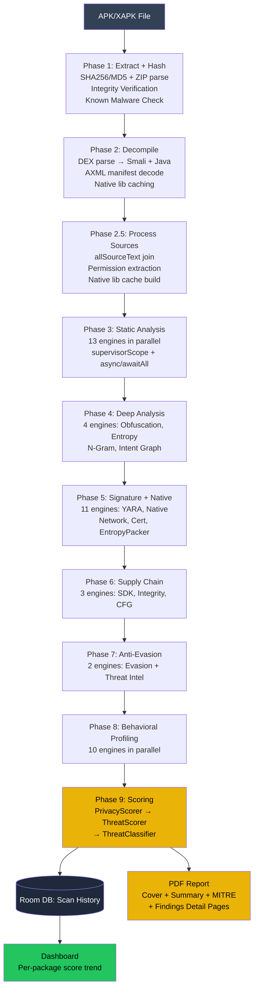
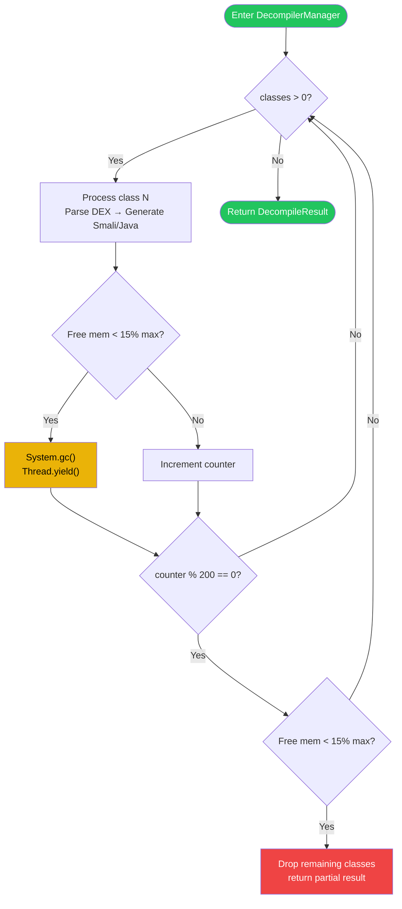
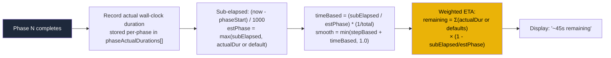
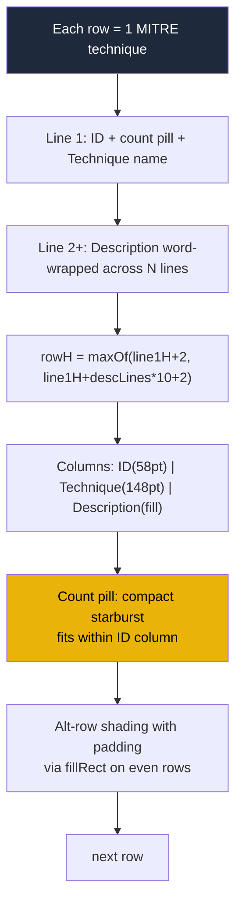
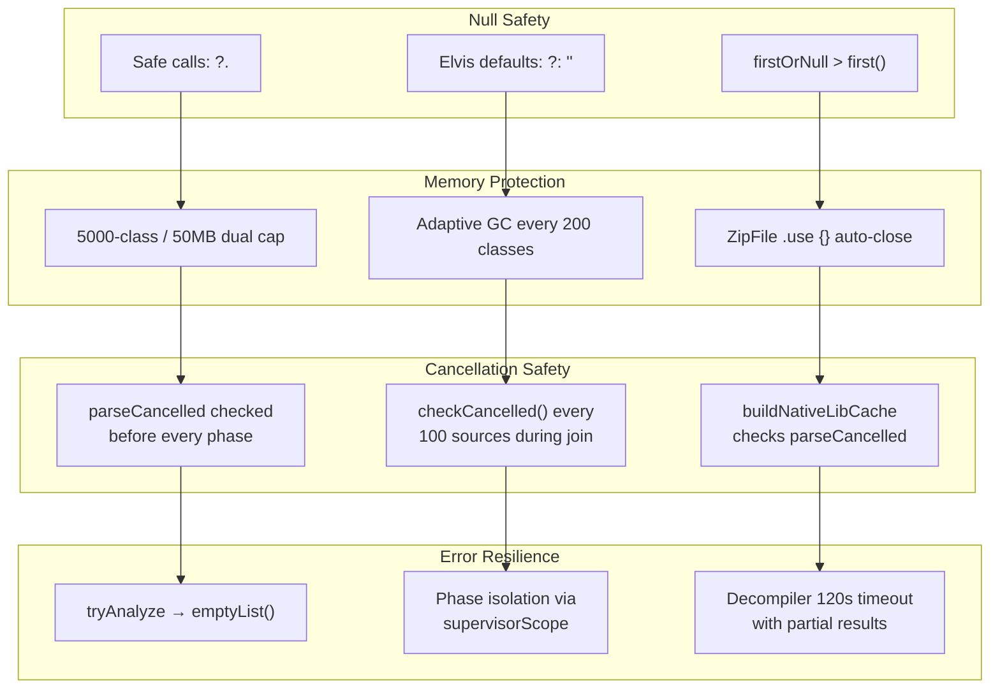

# APK Viper

**On-device Android APK security analyzer** — 38+ detection engines, 9-phase pipeline, 100% offline.

```
┌─────────────────────────────────────────────────────────────┐
│                    APK VIPER v1.0.0                         │
├─────────────────────────────────────────────────────────────┤
│  Static → Heuristic → Advanced → Deep → Detection → Profiling → Score    │
│  All analysis runs on-device. Zero data leaves your phone.  │
└─────────────────────────────────────────────────────────────┘
```

## Quick Start

```bash
# Prerequisites: JDK 17+, Android SDK 34+
# Build
./gradlew assembleDebug

# Run tests
./gradlew cleanTest testDebugUnitTest
# → 1133+ tests, all passing (0 failures)

# Install
./gradlew installDebug
```

## Features

### Detection Engines

| Category | Engines | What They Detect |
|----------|---------|-----------------|
| **Static** (5) | ManifestAnalyzer, PermissionAnalyzer, CertificateAnalyzer, CodeAnalyzer, StringExtractor | Manifest issues, dangerous permissions, cert validation, code patterns, hardcoded secrets |
| **Heuristic** (6) | PackerDetector, ObfuscationDetector, EntropyAnalyzer, MalwarePatternDetector, CryptoMinerDetector, BehavioralDetector | Packers, obfuscation, encrypted payloads, malware sigs, miners, SMS/call abuse |
| **Advanced** (6) | YaraEngine, NativeAnalyzer, NetworkAnalyzer, DexOpcodeAnalyzer, SDKAnalyzer, TaintAnalyzer | YARA rules, native calls, C2 domains, DEX stats, SDK tracking, data flow |
| **Deep** (6) | CfgStructuralAnalyzer, ApiCallGraphAnalyzer, OpcodeNgramAnalyzer, AccessibilityChainAnalyzer, BehaviorTimelineAnalyzer, IntentRelationGraphAnalyzer | CFG similarity, API chains, N-gram patterns, accessibility abuse, behavior timeline, intent chains |
| **Detection** (5) | AntiEvasionDetector, PermissionRiskMatrix, ModApkDetector, SecretLeakScanner, StringDeobfuscator | VM/debugger evasion, permission combos, mod APK detection, leaked secrets, obfuscated strings |
| **Profiling** (10) | PhishingOverlayAnalyzer, ShizukuDetector, VirtualAppDetector, TinyMLClassifier, ThreatIntelDB, BackgroundResourceMonitor, NativeBehaviorAnalyzer, StringDeobfuscator, NetworkBehaviorProfiler, BehaviorTimelineAnalyzer | Overlay phishing, Shizuku API, virtual environments, ML classification, threat intel, battery abuse, native behaviors |
| **Scoring** (3) | ThreatScorer, PrivacyScorer, ThreatClassifier | Weighted threat score, privacy risk, classification + remediation |

### Additional Capabilities

- **PDF Report Generation** — Multi-page professional PDF with cover page, real app icon (composited from ic_launcher_foreground + ic_launcher_background — no fallbacks), severity gauge, info cards, severity breakdown bar, MITRE ATT&CK table, finding detail cards, remediation checklist, file analysis table
- **9-Phase Scan Pipeline** — 38+ analyzers running in parallel with cancellation support and per-phase progress
- **Real-time Terminal Log** — Live scan progress with current analyzer activity and dynamic weighted ETA
- **APK File Monitor** — Background service watching Downloads/ for new APKs
- **Threat Timeline** — Per-package score trend in dashboard
- **Scan History** — Room database with timeline queries and package-name grouping
- **Auto-Update Engine** — Background rules + hashes + threat intel sync
- **XAPK Support** — Split APK extraction and per-split analysis
- **Storage Cleaner** — Temp file cleanup with 50MB+ guard
- **1133+ Unit Tests** — All passing (0 failures), covering every analyzer, data layer, service, UI logic, and PDF generation

## Architecture

### 9-Phase Pipeline

```mermaid
graph TB
    subgraph "Phase 1: Extract + Hash"
        P1[APK Extraction<br/>SHA256/MD5<br/>Integrity Check<br/>Known Malware Hash]
    end

    subgraph "Phase 2: Decompile"
        P2[DEX Parsing<br/>Smali Generation<br/>Java Decompilation<br/>Manifest Decode<br/>Native Lib Cache]
    end

    subgraph "Phase 3: Static Analysis 5 engines"
        P3[Manifest Analyzer<br/>Permission Analyzer<br/>Code Analyzer<br/>String Extractor<br/>Certificate Analyzer<br/>+ Packer, Miner, Opcode<br/>Taint, Behavioral, CallGraph<br/>PermMatrix, Secrets, ML]
    end

    subgraph "Phase 4: Deep Analysis 4 engines"
        P4[Obfuscation Detector<br/>Entropy Analyzer<br/>N-gram Analyzer<br/>Intent Graph]
    end

    subgraph "Phase 5: Signature + Native 11 engines"
        P5[YARA Engine<br/>Native Analyzer<br/>Network Analyzer<br/>Certificate Deep Scan<br/>Native Call Graph<br/>Bytecode Scanner<br/>Library Differ<br/>Entropy Packer<br/>+ MalwarePattern]
    end

    subgraph "Phase 6: Supply Chain 3 engines"
        P6[SDK Analyzer<br/>Framework Integrity<br/>CFG Structural]
    end

    subgraph "Phase 7: Anti-Evasion + Intel 2 engines"
        P7[Anti-Evasion Detector<br/>Threat Intel DB]
    end

    subgraph "Phase 8: Behavioral Profiling 10 engines"
        P8[Native Behaviors<br/>String Deobfuscator<br/>Phishing Overlay<br/>Network Profiler<br/>Behavior Timeline<br/>Mod APK Detector<br/>Shizuku Detector<br/>Virtual App Detector<br/>Accessibility Chain<br/>Resource Monitor]
    end

    subgraph "Phase 9: Scoring"
        P9[Privacy Scorer<br/>Threat Scorer<br/>Threat Classifier<br/>→ Score + Classification]
    end

    P1 --> P2 --> P3 --> P4 --> P5 --> P6 --> P7 --> P8 --> P9

    style P1 fill:#1e293b,color:#fff
    style P2 fill:#1e293b,color:#fff
    style P3 fill:#1e293b,color:#fff
    style P4 fill:#334155,color:#fff
    style P5 fill:#1e293b,color:#fff
    style P6 fill:#334155,color:#fff
    style P7 fill:#1e293b,color:#fff
    style P8 fill:#334155,color:#fff
    style P9 fill:#eab308,color:#000
```



### Data Flow



### Scan Progress Flow

```mermaid
sequenceDiagram
    participant User
    participant HomeScreen
    participant ScanViewModel
    participant ScanPipeline
    participant Decompiler
    participant Analyzers
    participant DB as Room DB

    User->>HomeScreen: Select APK file
    HomeScreen->>ScanViewModel: startScan(uri, name)
    ScanViewModel->>ScanViewModel: state = PREPARING
    Note over ScanViewModel: acquire WakeLock<br/>start ForegroundService

    rect rgb(30, 41, 59)
        Note over ScanPipeline: Phase 1: Extract + Hash
        ScanPipeline->>ScanPipeline: copy APK to cache<br/>SHA256/MD5 hash<br/>XAPK detection
        ScanPipeline-->>ScanViewModel: progress(1/9, "Extracting APK")
    end

    rect rgb(30, 41, 59)
        Note over ScanPipeline,Decompiler: Phase 2: Decompile
        ScanPipeline->>Decompiler: decompile(apkFile)
        Decompiler->>Decompiler: DEX parse → smali → Java<br/>manifest decode<br/>withTimeout(120-300s)
        Decompiler-->>ScanPipeline: DecompileResult
        ScanPipeline-->>ScanViewModel: progress(2/9, "11358 classes extracted")
        Note over ScanPipeline: Phase 2.5: Process Sources<br/>join allSourceText<br/>build native lib cache<br/>WITH progress updates
        ScanPipeline-->>ScanViewModel: progress update every 500 sources
    end

    rect rgb(30, 41, 59)
        Note over ScanPipeline,Analyzers: Phase 3-8: Main Analysis
        loop Each Phase (3 through 8)
            ScanPipeline->>Analyzers: supervisorScope { async(...) }
            par All Analyzers In Phase
                Analyzers-->>ScanPipeline: List<Finding>
            end
            ScanPipeline-->>ScanViewModel: progress(N/9, "Analyzer activity...")
            ScanPipeline-->>ScanViewModel: onFinding(severity, title)
        end
    end

    rect rgb(234, 179, 8)
        Note over ScanPipeline: Phase 9: Scoring
        ScanPipeline->>Analyzers: PrivacyScorer → ThreatScorer → ThreatClassifier
        Analyzers-->>ScanPipeline: scores + classification
    end

    ScanPipeline-->>ScanViewModel: ScanResult
    ScanViewModel->>DB: insert(result)
    ScanViewModel->>ScanViewModel: state = COMPLETE
    ScanViewModel-->>HomeScreen: auto-navigate to Results
    ScanViewModel->>ScanViewModel: release WakeLock<br/>stop ForegroundService
```



### Clean Architecture Layers

```
┌─────────────────────────────────────────────────────────────────┐
│                    UI LAYER (Jetpack Compose + Material3)        │
│  HomeScreen │ ScanScreen │ ResultsScreen │ Dashboard │ Settings │
└──────────────────────────────┬───────────────────────────────────┘
                               │
                    ┌──────────▼──────────┐     ┌──────────────────┐
                    │   ScanViewModel      │     │  Room DB /        │
                    │  State Machine        │     │  DataStore        │
                    │  IDLE→PREPARING→     │     │  (Scan History)   │
                    │  SCANNING→COMPLETE    │     └──────────────────┘
                    └──────────┬──────────┘
                               │ withContext(IO)
                    ┌──────────▼──────────────────────────────────┐
                    │             ScanPipeline                     │
                    │  supervisorScope / async / awaitAll          │
                    │  Phases 1-9 → 38+ analyzers in parallel     │
                    ├──────────────────────────────────────────────┤
                    │  Cancellation: parseCancelled flag checked   │
                    │  before every phase and every 100 sources    │
                    │  OOM Guard: 5000 classes / 50MB cap          │
                    │  Per-analyzer: 45s timeout via tryAnalyze    │
                    │  Decompile: 120-300s timeout + partial return │
                    └──────────────────────────────────────────────┘
```

## Threat Scoring

| Level | Score | Criteria |
|-------|-------|----------|
| SAFE | 0–25 | No suspicious indicators |
| LOW | 26–50 | Minor concerns (debug cert, backup enabled) |
| MEDIUM | 51–65 | Several moderate indicators |
| HIGH | 66–80 | Major findings (packer, evasion) |
| CRITICAL | 81–90 | Severe threats (ransomware, banking trojan) |
| MALICIOUS | 91–100 | Confirmed malicious payload |

```
SAFE ████████████████████████████████████████████░░░░░░░░░░░░  0-25
LOW  ████████████████████████████████████████████████████████ 26-50
MED  ████████████████████████████████████████████████████████ 51-65
HIGH ████████████████████████████████████████████████████████ 66-80
CRIT ████████████████████████████████████████████████████████ 81-90
MAL  ████████████████████████████████████████████████████████ 91-100
```

## Mod APK Detection (3-Tier)

```
┌───────────────────────────────────────────────────────────┐
│              ModApkDetector — 3-Tier Hybrid                │
├───────────────┬───────────────────┬───────────────────────┤
│   TIER 1      │     TIER 2        │      TIER 3           │
│  SOO Anomaly  │  Cross-Validation  │  Confidence Scoring   │
│               │                   │                       │
│  DEX string   │ Check if findings │ isLikelyGenuineMod(): │
│  offset order │ span multiple     │ downgrade if only     │
│  disruption   │ categories (perm, │ harmless perms +      │
│  detection    │ api, native, comp)│ known mod signers     │
└───────────────┴───────────────────┴───────────────────────┘
```

## Project Structure

```
app/src/main/java/com/apkviper/
├── App.kt                       # Application — schedules auto-update
├── MainActivity.kt              # Entry point + Compose navigation
├── data/
│   ├── AppDatabase.kt           # Room DB + Gson TypeConverters
│   ├── ScanDao.kt               # DAO: recent, timeline, package queries
│   └── SettingsDataStore.kt     # DataStore: auto-update, signature counts
├── dex/
│   ├── AxmlDecoder.kt           # Binary AndroidManifest → text
│   ├── DexParser.kt             # Custom DEX parser (string/field/method/class)
│   └── SmaliDisassembler.kt     # DEX bytecode → smali text
├── engine/
│   ├── ScanPipeline.kt          # Central orchestrator — 9 phases
│   ├── StorageCleaner.kt        # Temp file cleanup + entropy-based ranking
│   ├── advanced/                # 26 advanced analysis engines
│   ├── classification/          # ThreatClassifier
│   ├── decompile/               # DecompilerManager
│   ├── dex/                     # DexOpcodeAnalyzer
│   ├── heuristic/               # 6 heuristic detectors
│   ├── malware/                 # KnownMalwareDB, KnownGoodDB
│   ├── native/                  # FrameworkWhitelist, NativeAnalyzer
│   ├── network/                 # NetworkAnalyzer
│   ├── report/                  # PdfGenerator (real app logo, no fallbacks)
│   ├── scoring/                 # ThreatScorer, PrivacyScorer
│   ├── static/                  # 5 static analyzers
│   ├── supplychain/             # SDKAnalyzer
│   ├── taint/                   # TaintAnalyzer
│   ├── update/                  # AutoUpdateEngine, UpdateScheduler
│   ├── xapk/                    # XapkExtractor
│   └── yara/                    # YaraEngine (Aho-Corasick automaton)
├── model/
│   └── ScanModels.kt            # ScanResult, Finding, DecompileResult, enums
├── service/
│   ├── ApkFileMonitorService.kt # FileObserver: watches Downloads for APKs
│   └── ScanForegroundService.kt # BG scan notification with progress
├── ui/
│   ├── dashboard/               # History dashboard + per-package score trend
│   ├── home/                    # Main screen + tab navigation + file picker
│   ├── results/                 # Scan results with expandable finding cards
│   ├── scan/                    # ScanView: terminal + progress + ETA
│   ├── settings/                # Configuration + APK monitor toggle
│   ├── terminal/                # Terminal log models
│   └── theme/                   # Colors (copper/amber, warm surfaces), typography, theme
└── util/
    └── HashUtils.kt             # Streaming SHA256/MD5 hashing
```

## Tech Stack

| Component | Technology |
|-----------|-----------|
| Language | Kotlin 1.9.21 |
| UI | Jetpack Compose + Material3 (BOM 2024.06.00) |
| Database | Room 2.6.1 + Gson + KSP |
| Preferences | DataStore Preferences 1.0.0 |
| PDF | `android.graphics.pdf.PdfDocument` (zero external deps) |
| Async | Kotlin Coroutines 1.7.3 + Flow |
| DEX Parsing | Custom binary parser (31 KB, no deps) |
| YARA | Custom Aho-Corasick automaton (no native deps) |
| ML | Custom TinyML Random Forest (20 trees) |
| Networking | OkHttp 4.12.0 (update checks only) |
| Testing | JUnit 4.13.2 + Robolectric 4.11.1 + Espresso 3.5.1 |
| Build | AGP 8.5.0, Kotlin 1.9.21, KSP |
| SDK | compileSdk=34, targetSdk=34, minSdk=26 |

## Key Flows

### Memory-Adaptive Decompilation



### Dynamic Weighted ETA



### MITRE ATT&CK PDF Table Layout



## Edge Case Handling



| Scenario | Protection | Location |
|----------|-----------|----------|
| Empty scan history | Returns empty view, no crash | DashboardScreen.kt |
| Null taint register | `?: continue` guard (no NPE) | TaintAnalyzer.kt |
| Missing icon resource | Throws clear error at startup | PdfGenerator.kt |
| Negative notification ID | `Math.abs(name.hashCode())` | ApkFileMonitorService.kt |
| Memory pressure in decompile | `System.gc()` every 200 classes | DecompilerManager.kt |
| 5000+ classes or 50MB+ sources | Null allSourceText; sampled analyzers | ScanPipeline.kt |
| ZipFile leak | `.use {}` auto-close on exception | ScanPipeline.kt, all analyzers |
| Race on scan start | `isScanning`/`isPreparing`/`result` guards | HomeScreen.kt |
| Scan resume after kill | SharedPreferences `scan_active` checkpoint | ScanForegroundService.kt |
| WakeLock timeout | 10-minute timeout prevents battery drain | ScanViewModel.kt |
| Source join for 11K+ classes | Progress every 500 sources, cancellation every 100 | ScanPipeline.kt |
| Decompile timeout | 120s smali + 120s java timeouts with partial results | DecompilerManager.kt |

## Security

```
┌──────────────────────────────────────────────────────────┐
│                 SECURITY PROPERTIES                       │
├──────────────────────────────────────────────────────────┤
│  ✓ 100% on-device — no data ever leaves                   │
│  ✓ No network permission needed for scanning              │
│  ✓ Temp files deleted after scan via StorageCleaner       │
│  ✓ 5000-class / 50MB dual OOM guard on source joins      │
│  ✓ ZipFile .use{} — no file descriptor leaks              │
│  ✓ parseCancelled flag checked at every phase + sub-step  │
│  ✓ Foreground service preserves scan across background    │
│  ✓ Wake lock prevents CPU sleep during scan               │
│  ✓ PDF report uses real app icon only (no fallbacks)     │
│  ✓ DecompilerManager: 120s timeouts prevent hangs         │
│  ✓ ProGuard keep rules for Room entities + Gson models    │
└──────────────────────────────────────────────────────────┘
```

## License

Distributed under the MIT License. See [`LICENSE`](./LICENSE) for full text.

Copyright (c) 2026 — APK Viper

All analysis is performed on-device. No data leaves your device.
